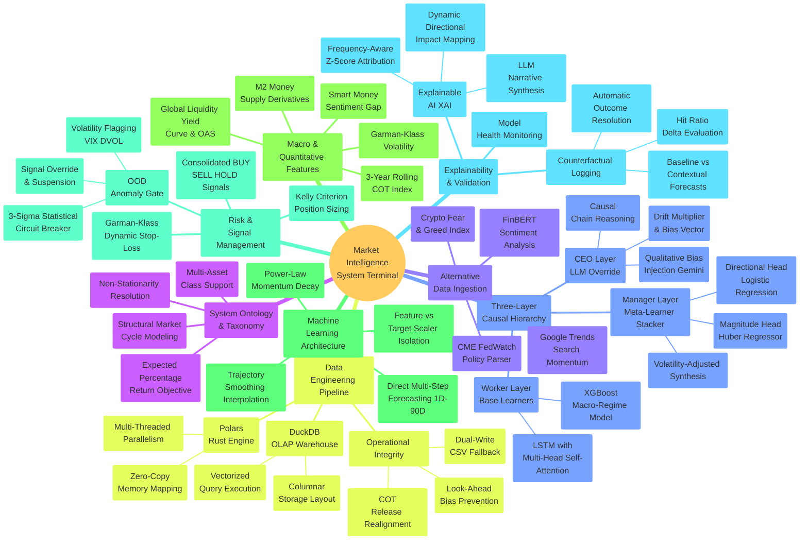

# Market Intelligence 2.0

> **Hierarchical Financial Intelligence & Macro Simulation Engine**
> A production-grade 3-layer AI system for Gold (XAUUSD), Bitcoin, and US Equities.
> Combines LSTM sequence learning, XGBoost macro-regime detection, and a Dual-Head Ensemble Stacker
> with Monte Carlo probability clouds, real-time macroeconomic factor injection, and Institutional Risk Management (Kelly Criterion & OOD Circuit Breakers).

---

## Table of Contents

1. [Quick Start](#quick-start)
2. [Architecture Overview](#architecture-overview)
3. [Macroeconomic & Risk Framework](#macroeconomic--risk-framework)
4. [Statistical & Quantitative Methods](#statistical--quantitative-methods)
5. [Data Pipeline (DuckDB + Polars)](#data-pipeline)
6. [Project Structure](#project-structure)
7. [Model Training Pipeline](#model-training-pipeline)
8. [Latest Backtest Performance](#latest-backtest-performance)
9. [Disclaimer](#disclaimer)

---

## Quick Start

### Option A — Double-Click (Windows)
```
Double-click: run_app.bat
```
This automatically activates the virtual environment (`.venv`) and starts the Streamlit server.
The terminal stays open so you can monitor logs. Press any key to close when done.

### Option B — Manual (PowerShell / CMD)
```powershell
# Activate virtual environment
.venv\Scripts\activate

# Start the app
streamlit run app.py
```

### Option C — Fresh Install
```powershell
# 1. Clone
git clone https://github.com/ken968/Market-Intelligence.git
cd Market-Intelligence

# 2. Create virtual environment and install dependencies
python -m venv .venv
.venv\Scripts\activate
pip install -r requirements.txt

# 3. Configure API keys (copy the template below to .env)
# GEMINI_API_KEY=your_gemini_key_here
# NEWSAPI_KEY=your_newsapi_key_here
# FINNHUB_API_KEY=your_finnhub_key_here

# 4. Sync data & Fetch Alternatives (first run)
python scripts/fred_fetcher.py
python scripts/data_fetcher_v2.py
python scripts/sentiment_fetcher_v2.py all
python scripts/cot_fetcher.py
python scripts/backfill_history.py

# 5. Train models
python scripts/train_lstm_pct.py gold
python scripts/train_lstm_pct.py btc
python scripts/train_lstm_pct.py spy
python scripts/train_xgboost_macro.py gold
python scripts/train_xgboost_macro.py btc
python scripts/train_xgboost_macro.py spy
python scripts/train_ridge_stacker.py        # trains Gold + BTC + SPY

# 6. Launch
run_app.bat
```

---

## Architecture Overview

### System Mind Map



The system uses a strict **3-Layer Causal Hierarchy** to separate model concerns:

```text
┌─────────────────────────────────────────────────────────────┐
│  LAYER 3 — CEO Layer (Gemini LLM Contextual Bias)           │
│  Purpose: Inject macro narrative & regime context           │
│  Input:   News headlines + macro_summary                    │
│  Output:  drift_multiplier ∈ [0.85, 1.15] + bias_vector    │
│  File:    utils/llm_manager.py                              │
├─────────────────────────────────────────────────────────────┤
│  LAYER 2 — Manager Layer (Dual-Head Ensemble Stacker)       │
│  Purpose: Combine LSTM + XGBoost signals, correct endpoint  │
│  Architecture:                                              │
│    Head 1: LogisticRegressionCV → Direction (UP/DOWN)       │
│    Head 2: HuberRegressor       → Magnitude (% change)      │
│    Combined: direction_signal × |magnitude|                 │
│  File:    utils/layers/manager_anchor.py                    │
│           scripts/train_ridge_stacker.py                    │
├─────────────────────────────────────────────────────────────┤
│  LAYER 1 — Worker Layer (LSTM + XGBoost Base Models)        │
│  LSTM:  Sequence-based momentum & micro pattern learning    │
│  XGB:   Macro regime detection via lagged economic features │
│  Files: utils/layers/worker_lstm.py                         │
│         scripts/train_lstm_pct.py                           │
│         scripts/train_xgboost_macro.py                      │
└─────────────────────────────────────────────────────────────┘
```

### Forecast Pipeline (per request)
1. `ensemble_forecast()` — LSTM + XGBoost → Dual-Head Stacker → 7D signal
2. `pct_chain_forecast(N)` — Direct Multi-Step paths anchored to the stacker
3. Monte Carlo fan chart — 500 GBM paths using live IV (Deribit DVOL / CBOE VIX)
4. Out-of-Distribution (OOD) Gate — Circuit breaker for macro anomalies

---

## Macroeconomic & Risk Framework

The system is grounded in standard institutional macro analysis and strict risk protocols.

### Out-of-Distribution (OOD) Circuit Breaker
To protect capital during "Black Swan" events or Regime Shifts, the system forces a **HOLD** status and zeroes out allocations if:
- **CBM (Circuit Breaker Metric) $\ge$ 3**: Three or more macro variables deviate by $>3$ Standard Deviations (Z-Score $\ge 3.0$).
- **VIX $> 35.0$**: Extreme broad market panic.
- **Extreme Garman-Klass Volatility**: BTC $> 80\%$, Gold $> 30\%$, Equities $> 40\%$.

### Dynamic Stop-Loss (Garman-Klass Volatility)
Stop-losses are not static percentages. They breathe with the market using the Garman-Klass estimator:
```math
\text{Stop Loss Pct} = 1.5 \cdot \text{GK\_Vol\_21d} \cdot \sqrt{7/252}
```

### Kelly Criterion Position Sizing
When the Dual-Head Stacker provides a directional probability ($P$) and a Risk/Reward ratio ($B$), the system calculates optimal allocation using a **Half-Kelly** fraction to minimize drawdown:
```math
f^* = P - \frac{1 - P}{B}
```
*Note: Risk/Reward ratio is clamped between 1.0 and 5.0 to prevent irrational allocations.*

### Smart Money Sentiment Gap (COT)
By downloading Commitment of Traders (COT) data directly from the CFTC, the system calculates `Net_Commercial` positions to detect when Institutional Hedgers diverge from Retail Speculators (Fear & Greed Index). This synthetic feature is the #1 driver for Gold and BTC XGBoost models.

---

## Statistical & Quantitative Methods

### Dual-Head Ensemble (Ridge Stacker — Upgraded)
Traditional Ridge Regression stackers minimize MSE, creating a tension between hit ratio (direction) and magnitude accuracy. The Dual-Head approach separates these objectives:

```
Head 1 (Direction): LogisticRegressionCV
   Input:  [lstm_pred, xgb_pred, VIX, GK_Vol, Sentiment, YieldCurve, DXY, Fear_Greed, Net_Commercial]
   Target: y_dir = 1 if price_7d_later > price_today else 0
   Loss:   Cross-entropy (maximizes directional accuracy)

Head 2 (Magnitude): HuberRegressor(epsilon=1.35)
   Input:  Same meta-features
   Target: y_pct = (price_7d_later - price_today) / price_today
   Loss:   Huber(δ=1.35) — outlier-robust (crash weeks don't dominate the fit)
```

### LSTM Training: Percentage Change Target
The LSTM is **not** trained to predict absolute prices. The target is the 7-day forward percentage change. Predicting % changes is stationary (prices are not), which dramatically improves LSTM generalization.

---

## Data Pipeline (DuckDB + Polars)

To support institutional-grade execution speeds and eliminate CSV parsing bottlenecks, Market Intelligence 2.0 uses an embedded analytical database architecture:

1. **DuckDB**: Acts as the SQL engine for ultra-fast columnar JOINs of OHLCV prices, macro indicators (FRED), and sentiment scores.
2. **Polars**: Executes parallelized, zero-copy feature engineering (e.g., Z-Scores, EWMA, shift/lags).
3. **Pseudo-ACID CSV Fallback**: Every DuckDB write is simultaneously backed up to a CSV. If DuckDB corrupts or is missing dependencies, the Streamlit UI safely falls back to reading CSVs without breaking.

---

## Project Structure

```
Market-Intelligence/
├── app.py                              # Streamlit entry point
├── run_app.bat                         # One-click launcher (Windows)
├── pages/
│   ├── 1_Dashboard.py                  # Portfolio overview + AI batch predictions
│   ├── 5_Model_Operations.py           # Model Health Monitor & AI diagnostics
│   ├── 6_Trading_Signals.py            # Risk Layer, Kelly Sizing, OOD Gates
│   └── 7_Settings.py                   # Data sync controls
│
├── scripts/                            # Data pipeline & training
│   ├── data_fetcher_v2.py              # OHLCV + macro merge → DuckDB
│   ├── fred_fetcher.py                 # FRED macro series
│   ├── sentiment_fetcher_v2.py         # News + FearGreed
│   ├── cot_fetcher.py                  # CFTC Commitment of Traders fetcher
│   ├── migrate_to_duckdb.py            # CSV to DuckDB migration tool
│   ├── train_lstm_pct.py               # LSTM training (pct-change target)
│   ├── train_xgboost_macro.py          # XGBoost macro model training
│   └── train_ridge_stacker.py          # Dual-Head Stacker training
│
├── utils/                              # Core library
│   ├── data_store.py                   # DuckDB + Polars connection manager
│   ├── predictor.py                    # Orchestrator: AssetPredictor class
│   ├── signal_generator.py             # Trading signal & Risk Layer math
│   ├── macro_processor.py              # Macro context builder
│   ├── xai_explainer.py                # Z-Score anomaly detection
│   └── layers/                         # 3-Layer inference sub-modules
│
├── data/                               # Data warehouse (Git-ignored)
│   ├── market_intelligence.db          # Main DuckDB analytical database
│   └── backups/                        # CSV dual-write fallbacks
│
└── tests/
    ├── test_core.py                    # Core pipeline pytest suite
    └── test_risk_layer.py              # Circuit breaker & Kelly math validation
```

---

## Model Training Pipeline

### Full Re-training Sequence
```powershell
# 1. Sync all data sources
python scripts/fred_fetcher.py
python scripts/data_fetcher_v2.py
python scripts/sentiment_fetcher_v2.py all
python scripts/cot_fetcher.py

# 2. Train base LSTM models (pct-change architecture)
python scripts/train_lstm_pct.py gold
python scripts/train_lstm_pct.py btc
python scripts/train_lstm_pct.py spy

# 3. Train XGBoost macro models
python scripts/train_xgboost_macro.py gold
python scripts/train_xgboost_macro.py btc
python scripts/train_xgboost_macro.py spy

# 4. Train Dual-Head Ensemble Stacker
python scripts/train_ridge_stacker.py
```

---

## Latest Backtest Performance (May 2026)

With the inclusion of Alternative Data (Fear & Greed Crypto), Smart Money Positioning (COT Net Commercials), and full historical backfilling (2020–2026), the XGBoost and Stacker layers reached new highs.

| Asset | Hit Ratio (Direction Accuracy) | Primary Driver (XAI) |
|-------|----------------|----------------------|
| **Gold** | **66.5%** | `Net_Commercial` (COT), `DXY` |
| **BTC** | **55.5%** | `Inst_Sentiment_Ratio` (Fear&Greed vs COT) |
| **SPY** | **61.5%** | `YieldCurve_10Y2Y`, `VIX` |

*Notes:*
- The Dual-Head Stacker safely overrides the LSTM when macro anomalies are present.
- BTC performance (55.5%) reflects the inherently noisy nature of crypto markets; however, the `Inst_Sentiment_Ratio` feature significantly curbed false breakouts.
- Hit Ratios above 60% transition the system from a "Predictor" to an "Institutional Strategy", unlocking the viability of the Phase 6 Kelly Criterion sizing layer.

---

## Disclaimer

This platform is a financial intelligence research tool built for educational and analytical purposes. AI predictions are probabilistic estimates based on historical patterns and macroeconomic indicators. They are **not** investment advice.

- Hit ratios < 60% indicate significant uncertainty; treat all signals directionally only.
- The **OOD Circuit Breaker** is a mathematical failsafe, but does not guarantee protection against unmodeled Black Swans.
- Always apply proper risk management. The provided Kelly Allocation is aggressive and should be used as a relative sizing metric, not an absolute portfolio instruction.

*Built with: DuckDB · Polars · TensorFlow/Keras · XGBoost · scikit-learn · Streamlit · Pandas · yfinance · FRED API*
